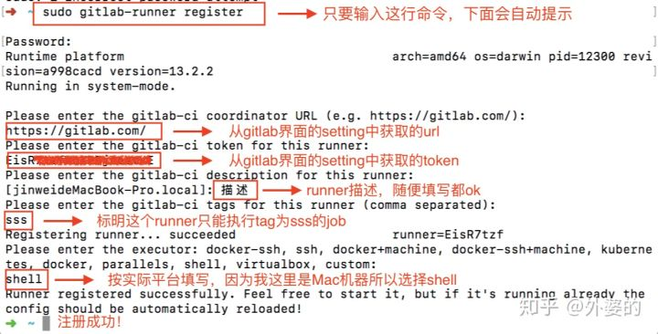
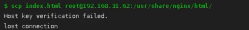

#### 1. 执行机（**Executor**）

运行程序的机器

- 安装nodejs

```PowerShell
# 1、下载nodejs
wget https://nodejs.org/dist/v14.17.4/node-v14.17.4-linux-x64.tar.xz
# 2、解压nodejs
tar -xvf node-v14.17.4-linux-x64.tar.xz
# 3、修改文件夹名字，在xftp内完成即可
# 4、建立软链接
$ ln -s /usr/local/nodejs/bin/node /usr/local/bin
$ ln -s /usr/local/nodejs/bin/npm /usr/local/bin

```

参考链接：[https://blog.csdn.net/weixin_43820866/article/details/103683322](https://blog.csdn.net/weixin_43820866/article/details/103683322)

- 安装git

```PowerShell
yum -y install git
git --version

```
- 安装nginx，用于访问已打包好的前端项目

详情：安装nginx

#### **2. 在平台上下载并安装Gitlab-runner命令行**

```PowerShell
# 安装
sudo curl -L --output /usr/local/bin/gitlab-runner "https://gitlab-runner-downloads.s3.amazonaws.com/latest/binaries/gitlab-runner-linux-amd64"
# 配置权限
sudo chmod +x /usr/local/bin/gitlab-runner
# 初始化gitlab-runner
cd ~
gitlab-runner install
gitlab-runner start

```

#### 3. 注册Runner

```PowerShell
# 注册
sudo gitlab-runner register
```



#### 4. 激活Runner

```PowerShell
sudo gitlab-runner verify
```

#### 5.  .gitlab-ci.yml文件配置

```YAML
stages: # 分段
  - install
  - build
  - deploy
 
cache: # 缓存
  paths:
    - node_modules
    - dist
 
install-job:
  tags:
    - report-ui-tag-1118
  stage: install
  script:
    - npm -v
    - npm config set registry https://registry.npm.taobao.org 
    - npm install
  only:
    - main
 
build-job:
  tags:
    - report-ui-tag-1118
  stage: build
  script:
    - npm run build
  only:
    - main
 
deploy-job:
  tags:
    - report-ui-tag-1118
  stage: deploy
  script:
    - echo $USER
    - scp -r ./dist root@190.92.233.13:/home/nginx/html/report-ui
  only:
    - main
```

#### 6. 解决卡在deploy问题

若出现如下问题：（原因：未进行免交互认证）



使用以下方法解决：

```PowerShell
# 查看gitlab-runner使用的用户
在.gitlab-ci.yml中打印echo $USER，输出gitlab-runner

# 服务器中切换为gitlab-runner账号
su - gitlab-runner

# 创建免交互密钥对
ssh-keygen

# 复制密钥对
ssh-copy-id root@190.92.233.13
```