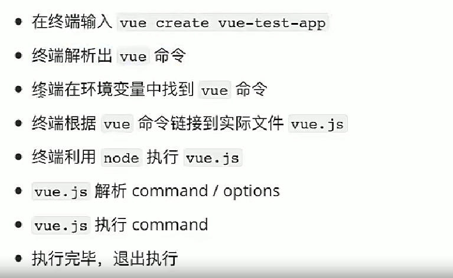

- 为什么全局安装@vue/cli后添加的命令为vue？
- 全局安装@vue/cli时发生了什么？
- 执行vue命令时发生了什么？为什么vue指向一个js文件，我们却可以通过vue命令去执行？

    where vue→找到vue在C:\Users\zl859\AppData\Roaming\npm\vue.cmd→此文件中有"%_prog%"  "%dp0%\node_modules\@vue\cli\bin\vue.js" 代码，所以本质上执行vue命令时，是用node执行"%dp0%\node_modules\@vue\cli\bin\vue.js"